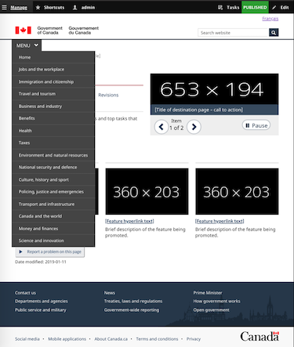

# Architecture

By: William Hearn and Zachary Seguin (Statistics Canada)

## Introduction

This document represents a high-level overview of how Drupal should be implemented in the cloud to support any of the Government of Canada procured service providers (AWS, Azure, and GCP). We are leveraging a microservices design pattern through containerization running on Kubernetes.

A key mandate is to follow the Open Source Directive as given by the Treasury Board Secretariat (C.2.3.8) which states where possible, use open standards and open source software first. Additionally, where possible expose all functionality as services (RESTFul) and leverage microservices via a containerized approach (C2.3.10).

Key Criteria

- Ability to dynamically scale workloads based on custom metrics (CPU / memory)
- Blue-Green, and Canary style deployments
- Easily migrate workloads to different cloud providers or on-premise environments
- Design networks to be compliant with ITSG-22
- Follow the CIS Benchmarks for both Docker + Kubernetes
- Facilitate a managed service model whereby a new deployment is done via a single YAML template

For your convenience and to show we are actively interested in helping we have created a Drupal 8 &quot;Canada&quot; distribution where we provide all of the repository links at the end of this document. Should you wish to move this work to the canada-ca GitHub repository we will happily assist in moving it over and ensuring all the integration still works correctly.

Finally, it should be mentioned we can easily spin up a site in either our production / innovation Kubernetes cluster should you wish to see how everything is set up in a live environment. We can also provide a demo and any additional information you may need about the infrastructure.

## **Components**

The components are individually described below. The components perform the same function in both the content staging and public environments.

## Kubernetes

**Recommendation:** [Kubernetes](https://kubernetes.io/)

Without going to in-depth Kubernetes is the defacto winner of the orchestration wars and is supported by all cloud vendors including all offering a managed service and also works on both private / public infrastructure. The fact that most if not all cloud companies are centralizing around this solution also was a key decision point (Oracle, IBM, Pivotal, RedHat, VmWare, etc) along with the need to reduce vendor lock-in. Finally, the ability to move our workloads across cloud providers or even supporting a federated cluster across cloud providers for reliability was another key factor in the decision making.

The whole Drupal application stack can easily be installed in a highly distributed fashion in mere minutes using either our helm chart or the via the Drupal Operator (recommended) which facilitates a more managed service workflow (rolling updates, cronjobs, health checks, auto-scaling, etc). The operator is currently being used at Statistics Canada.

1. Helm chart: [https://github.com/drupalwxt/helm-drupal](https://github.com/drupalwxt/helm-drupal)
2. Drupal Operator: [https://github.com/sylus/drupal-operator](https://github.com/sylus/drupal-operator)

## Ingress controller

**Recommendation:** [Traefik](https://traefik.io/)

The ingress controller is responsible for accepting external HTTP connections and routing them to backend applications based on configuration defined in Kubernetes Ingress objects. Routing can be done by domain and/or path.

Traefik the open source cloud native edge router provides automatic HTTPS and renewal for our microservices by leveraging the Lets Encrypt service. Additional features include multiple load balancing algorithms, enhanced tracing + metrics and all information readily exposed through a RESTful API.

## Varnish

**Recommendation:** [Varnish](https://varnish-cache.org/)

Varnish is a highly customizable reverse proxy cache. This will aid in supporting a large number of concurrent visitors as the final rendered pages can be served from cache. Varnish is only required on the public environment and is not used in the content staging environment.

It should be noted that Nginx can technically address some of the cache requirements needed, however the open source version does not support purging selective pages. We need to clear caches based on content being updated / saved which Varnish supports along with the Expire Drupal module quite readily.

## Nginx

**Recommendation:** [Nginx](https://www.nginx.com/)

Nginx is an open source web server that can also be used a reverse proxy, HTTP cache, and load balancer. Due to its root in performance optimization under scale, Nginx often outperforms similarly popular web servers and is built to offer low memory usage, and high concurrency.

## Web (PHP-FPM)

**Recommendation:** [PHP-FPM](https://php-fpm.org/)

Drupal runs in the PHP runtime environment. PHP-FPM is the process manager organized as a master process managing pools of individual worker processes. Its architecture shares design similarities with event-driven web servers such as Nginx and allows for PHP scripts to use as much of the server&#39;s available resources as necessary without additional overhead that comes from running them inside of web server processes. The PHP-FPM master process dynamically creates and terminates worker processes (within configurable limits) as traffic to PHP scripts increases and decreases. Processing scripts in this way allows for much higher processing performance, improved security, and better stability. The primary performance benefits from using PHP-FPM are more efficient PHP handling and ability to use opcode caching.

## Database

**Recommendation:** [MySQL](https://www.mysql.com/) or [PostgreSQL](https://www.postgresql.org/)

Drupal maintains its state in a database and while supports several types only MySQL or PostgreSQL should be considered. Personally, we would highly recommend PostgreSQL based on the experience we had building / launching the Open Data portal but in the end, both run quite well with minimal issues.

## S3 Compatible Object Store

**Recommendation:** [Minio](https://www.minio.io/)

Drupal stores generated CSS/JS assets and uploaded content (images, videos, etc.) in a file storage. As the architecture is designed to be distributed, we will use a Drupal module ([s3fs](https://www.drupal.org/project/s3fs)) to store all of these stateful assets inside an object store. The object store can be Amazon S3 itself or another compatible store (e.g., Minio) which can work with both Azure and Google cloud storage.

## **Connecting to other services**

Drupal is built to be API first and with its rich data model is able to integrate with innumerable other services whether using API&#39;s (JsonAPI, GraphQL), direction connections, and / or legacy methods such as SOAP.

## Solr / Elasticsearch

Using the [SearchAPI](https://www.drupal.org/project/search_api) module in Drupal we can index content in a variety of search platforms with particular attention focused on either Solr or Elasticsearch. The Open Data site leverages Solr for all of its search pages including Access to Information and all of the proactive disclosure pages with custom facets. At Statistics Canada we are currently actively working on integration with Elasticsearch as well.

## Decoupled Approach (Vue.js, React, Angular)

An increasing trend in Drupal websites is the move to a more progressively enhanced, decoupled approach. Leveraging Drupal&#39;s entity api front-end JavaScript frameworks can perform the rendering whether the whole page or even a single component on the page. We recommend using a decoupled approach but also ensuring there is always an appropriate fall-back.

## Installation Profile

[https://github.com/drupalwxt/wxt](https://github.com/drupalwxt/wxt)

Installation profiles provide site features and functions for a specific type of site as a single download containing Drupal core, contributed modules, themes, and predefined configuration. They make it possible to quickly set up a complex, use-specific site. The Canada installation profile is a sub-profile off of WxT which is a sub-profile of Lightning.

Note: The WxT profile is very light and only adds the GCWeb theme and plugins support.

## Composer Project

Project for managing your dependencies via composer.

[https://github.com/drupalwxt/site-wxt](https://github.com/drupalwxt/site-wxt)

## Continuous Integration

Currently we are running all of our CI builds using Travis CI but can be easily switched to any of the other options such as CircleCI, VSTS, Jenkins, etc.

1. [https://travis-ci.org/drupalwxt/wxt](https://travis-ci.org/drupalwxt/wxt)
2. [https://travis-ci.org/drupalwxt/site-wxt](https://travis-ci.org/drupalwxt/site-wxt)

## Docker Registry

[https://hub.docker.com/r/drupalwxt/site-wxt](https://hub.docker.com/r/drupalwxt/site-wxt)

Currently we are storing all of our containers in Docker Hub. It is our recommendation that this should be switched to something like [Artifactory](https://jfrog.com/artifactory/) + [XRay](https://jfrog.com/xray/) which Statistics Canada uses that can scan the docker containers for any known vulnerability against all CVE&#39;s.
